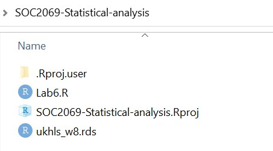

```{r setup, include = FALSE}
knitr::opts_chunk$set(
  comment = ""
)
```

```{r klippy, echo=FALSE, include=TRUE}
klippy::klippy(position = c('right'))
```

------------------------------------------------------------------------

    Timetable week: 11
    Topic: "Variables and descriptive statistics"
-----------------------------------------------------------------------

# Intro

This week we begin learning how to analyse quantitative data using the free, open-source, statistical analysis programme `R` via the `RStudio` interface. 

If you did not complete the online `R`/`RStudio` training during reading week, complete it as soon as possible. The labs/workshops provide only limited time to complete more substantive quantitative analysis exercises, so you should make sure to get a firmer grasp of the software outside class.

Datacarpentry online training "R for Social Scientists": https://datacarpentry.org/r-socialsci

# Readings

Core readings:

- Gelman et al. (2020): Chapters 2 (again) and 3 (pp. 21–47)
 
Secondary readings:

- Agresti (2018): Chapters 3 and 4 (pp. 29–94)
- Byrne (2002): Chapter 6 (pp. 95–111)

# Exercise 1: Getting to know the RStudio interface

`About 60  minutes`

------------------------------------------------------------------------

The term "`R`" is used to refer to both the programming language and the software that interprets the scripts written using it. To make it easier to interact with R, we will use RStudio. RStudio is the most popular IDE (Integrated Development Environment) for R. An IDE is a piece of software that provides tools to make programming easier. To function correctly, RStudio needs R and therefore both need to be installed on your computer. To install them on your own personal computers (**Windows** or **MacOS**), see the guidance on [Canvas](https://ncl.instructure.com/courses/48074/pages/software-requirements-and-access?module_item_id=2500821) or on [R for Social Scientists](https://datacarpentry.org/r-socialsci/setup.html).

R and RStudio should be available on all computers in the IT labs. You can find RStudio among the list of programs (in the Start menu) and open the programme directly. This will open a new RStudio session in the computer's default working directory. To make sure that all your files and outputs that you create are in the same place and accessible regardless of the computer you are using, it's best to get into the practice of using RStudio **projects**.

## Task 1: Open an RStudio project

An **RStudio Project** stores all the files and data objects and performs all the operations relative to the location of the project's root file on the computer.

To create a new R Project select *File > New Project* from the top RStudio menu.  

Creating a new R project will create:  

* A new project directory (folder)  
* A R project file (.Rproj) in the project folder that serves as a shortcut to open the project via RStudio  

Note:  

* You can make sub-folders for data, scripts, etc.  
* All files produced by R scripts saved to the project will also save into the project folder

You can try creating a new R Project, but for simplicity, you can download a folder already set up as an R Project from here: 

1. Download the compressed folder into a suitable location on your **OneDrive - Newcastle University** drive. This will allow you to access your files from any computer by logging into your university OneDrive account. 
2. Once downloaded, use the *Compressed Folders Tools* to extract the contents of the compressed folder.

The contents of the downloaded folder should look like this:



If you double-click on *SOC2069-Statistical-analysis.Rproj*, the project will open in a new RStudio window. The advantage of having an .Rproj file in the folder that you are using is that you don't have to worry about setting manually any paths to files that you will be using or producing; everything is stored relative to where the .Rproj file is located on your computer.

## Task 2: Using R scripts

R scripts are special text documents where you can write and execute commands in the `R` programming language. You can create an R Script from within RStudio by going to *File > New File > R Script* (also CNTRL + SHIFT + N). We already have an example R script in the folder you have just downloaded: **Lab6.R**. You can click on that file to open it. It will load in the upper left panel of RStudio. This example R script contains mainly comments and a single command, a simple arithmetic operation (1 + 3 - 5 + 7). You can use this script file to copy/paste commands from this window into it so you can run the commands in R.

## Task 3: Explore the RStudio (main) Panes

Let's have a closer look at the four (main) panes of RStudio:


### The R Console Pane  
The R Console, by default the left or lower-left pane in R Studio, is the home of the R "engine". This is where the commands are actually run and non-graphic outputs and error/warning messages appear. The **Console** is the direct interface to the `R` software itself; it's what we get if instead of `RStudio` we open the `R` software: a direct interface to the `R` programming language, where we can type commands and **where results/messages are printed**.

You can directly enter and run commands in the R Console, but realize that these commands are not saved as they are when running commands from a script. For this reason, we should not use the **Console** pane directly too much. For typing commands that we want `R` to execute, we should instead use an `R` script file, where everything we type can be saved for later and complex analyses can be built up. 

### The Source Pane  
This pane, by default in the upper-left, is a space to edit and run your scripts. This pane can also display datasets (data frames) for viewing.

### The Environment Pane  
This pane, by default the upper-right, is most often used to see brief summaries of objects in the R Environment in the current session. These objects could include imported, modified, or created datasets, parameters you have defined, or vectors or lists you have defined during analysis. You can click on the arrow next to a dataframe name to see its variables.

:::: {.notebox .note}
**Note**

If your Environment pane is empty, it means that you don't have any "objects" loaded or created yet. We will be creating some objects later and we will also import an example dataset.
::::


### Files, Plots, Packages, Help, etc  
The lower-right pane includes several tabs including plots (display of graphics including maps), help, a file library, and available R packages (including installation/update options).  

You can arrange the panes in different ways, depending on your preferences, using *Tools > Global Options in the top menu.* So the arrangement of panes may look different on different computers.

## Task 4: Start using functions and user-written packages

Most work in R is done using *Functions*. The most common operations involving a function take the following generic form (think of an analogy of baking a loaf of bread):


It's possible to **create your own functions**. This makes R extremely powerful and extendable. But instead of programming our own functions, we can rely on functions written by other people and bundled within **packages**. There are a large number of reliable, tested and oft-used packages containing functions that are particularly useful for social scientists. In this module, we will rely on several such user-written packages that extend the basic packages already bundled in with our `R` software (the so-called *base-R* packages and functions).

Packages are often available from the *Comprehensive R Archive Network* (CRAN) or private repositories such as *Bioconductor*, *GitHub* etc. Packages made available on CRAN can be installed using the command `install.packages("packagename")`. Once the package/library is installed (i.e. it is sitting somewhere on your computer), we then need to _load_ it to the current R session using the command `library(packagename)`.

### Installing and loading the `tidyverse`

Let's begin by installing and loading one of the most useful suite of packages called the 'tidyverse' (you can read more about the tidyverse [here](https://www.tidyverse.org/)). Type or copy the command below into the Console window and click Enter (or write it in the *Lab6.R* script file and run it from there; in fact, this command is already there in the script):

```{r eval=F}
install.packages("tidyverse")

library(tidyverse)
```

We now have access to functions contained in the 'tidyverse' bundle of packages. We can check the suite of packages that are loaded with the `tidyverse` library using a command from the `tidyverse` itself:

```{r, eval=FALSE}
tidyverse_packages()
```

If we don't want to load a package that we have downloaded - because maybe we only want to use a single function once and we don't want to burden our computer's memory - we can state explicitly which package the function is from by using the form *package::function*, like this:

```{r, eval=FALSE}
tidyverse::tidyverse_packages()
```

I will sometimes use this form in the worksheets to clarify what package a function originates from, even if the package is loaded in the library.

### Installing some other packages

:::: {.taskbox .task}

Now that you've installed a package, write the required functions in your R scripts to install and load the following two packages that we will be using later in this session:

- mosaic
- sjmisc
::::

```{r include=FALSE}
library(mosaic)
library(sjmisc)
```


### Load a dataset

So far we have learnt about some useful functions for installing and loading R packages. We can now look at functions that can be used to load a dataset into the Environment pane. We will load a dataset stored in `R`'s native format: .rds. There are other functions that are useful for loading data stored in other formats, particularly the most commonly used generic *comma separated values* (.csv) format, but we won't use them now.

Let's load the dataset called `ukhls_w8.rds` that is included in the *SOC2069-Statistical-analysis* project folder you downloaded earlier. We'll use the `readRDS` function and the assignment operator (`<-`) to create an object called "data" that will store the dataset (we can give any name to the object, but it's useful to have something short that is easy to type because we will be typing it a lot when writing commands targetted to that dataset). Copy the following command into your R script and run it from there:

```{r eval=FALSE}
data <- readRDS("ukhls_w8.rds")
```

```{r include=FALSE}
data <- readRDS("./../Data/ukhls_w8.rds")
```


This will only work if you are within an R Project; otherwise you need to provide the complete file path to the dataset.

You can now see that an object called "data" was created in the Environment pane, and next to it we have some information about the number of observations and variables in the dataset. If we click on the blue button with the white arrow before the name of the object, a list of variables and other information about them will roll down. If we click on the object's name or info, the dataset will open in the Sources pane, just next to the R script file. This is equivalent to having run the following command:
```{r eval=FALSE}
View(data)    

# Note the capital "V"; R is case-sensitive, so always pay attention; view(data) won't work
```

You can explore the dataset a bit. Only the first 50 columns (i.e. variables) are displayed, to see the next 50 you can click on arrow (>) in the dataset window's toolbar. Once you've had a quick look, you can close that view or return to the R script.

# Exercise 2: Explore the Understanding Society Wave 8 dataset

`About 15 minutes`

------------------------------------------------------------------------

We have already read about the Understanding Society survey in Week 1 and have had a look at the survey website. From now on, we will be using that website a lot to read about the survey and in paricular the variables that we will use form Wave 8. The dataset that we loaded in R in the previous exercise is a reduced version of the original dataset that can be accessed via the *UK Data Service*. The following page provides a few details about the reduced dataset that we will be using in the labs and for the assignment task: [https://cgmoreh.github.io/SOC2069/Data/ukhls_w8](https://cgmoreh.github.io/SOC2069/Data/ukhls_w8){target="_blank"}. As noted there too, you should also makes extensive use of the Variable Search function on the Understanding Society website, as there we can find more detailed information about the variables and their associated questionnaire questions.

Have a look through the dataset description and variable list to get a good sense of the data. Select 3-4 variables from the dataset description that you find confusing and search for them on the Understanding [Society's Variable Search page](https://www.understandingsociety.ac.uk/documentation/mainstage/dataset-documentation){target="_blank"}.

# Exercise 3: Basic descriptive statistics

`About 30 minutes`

------------------------------------------------------------------------

Let's learn a few functions that can help us explore variables through basic descriptive statistics. 

## Task 3.1: Tabulate categorical variables

Most of the variables in the dataset are categorical, so tabulating the frequency distributions of their categories can come handy. There are various ways for doing this in R, but one of the most convenient options is to use the `frq` function from the `{sjmisc}` package. 

Let's look, for instance, at the variable `sex`:

```{r eval=FALSE}
data %>% sjmisc::frq(sex)
```

Let's decipher the code above:
- first, we assume that there is an object called 'data' in our Environment that contains the *ukhls_w8.rds*; unless we restarted RStudio or deleted it, the object should still be there from the first exercise;
- the ` %>% ` operator (called a *pipe*) is a function loaded with the `tidyverse` and allows objects and functions to be fed (i.e. piped) forward to other functions. Getting into the habit of using the "pipe" workflow is particularly useful as it makes combining a series of operations/commands easier to read and follow. Here, we take our dataset and pipe it forward so that we can easily refer to variables from that dataset (such as *sex*);
- the remaining code applies the `frq` function from the `{sjmisc}` package to the variable *sex*

We could have written the following command, with the same result:

```{r eval=FALSE}
sjmisc::frq(data$sex)
```

Or if we already have the `{sjmisc}` package loaded with the `library` command, then:

```{r eval=FALSE}
frq(data$sex)
```

What we learn here is that another way of referring to variables within datasets is by using the `$` operator. Here, `data**$**sex` extracts the *sex* variable/column from the *data* object.

The resulting frequency table will be printed in the Console, and will look something like this:

```{r echo=FALSE}
frq(data$sex)
```

```{block , type = 'questionblock'}
**Question**

Interpret the table:

- How many of the respondents in the data are *female*?
- What is the percentage of *men* in the dataset?
- Are there any missing values (NAs) on this variable?
```

## Task 3.2: Summarize numeric variables

There are much fewer *numeric* variables in this dataset (an in sociological datasets in general). One that we have is the *age_dv* variable that codes respondents' age. The base-R function `summary` is enough to get a basic summary of a quantitative/numeric type variable:

```{r}
summary(data$age_dv)

# Base R functions don't always work with a pipe ( %>% ) workflow; summary doesn't, so we use the `$` operator
```

We can also use the `descr` function from `{sjmisc}`:

```{r}
data %>% sjmisc::descr(age_dv)
```

This function allows more control, so we can fine-tune which statistics we want to print and ad some other options. For example:

```{r}
data %>% sjmisc::descr(age_dv, show = c("n", "NA.prc", "mean", "sd", "md", "range"))
```

In this output, we selected some of the more useful statistics only and excluded the variable label. We could also use the `max.length` option in addition to `show` to set the maximum length of variable labels in the output, making it shorter if we wanted to. We can also include more than one variable in the function, which is useful for comparing several numeric variables.

The `c(...)` function used in the example above is used to combine values into vectors or lists. It is used very often in various contexts, so it is worth knowing about. Here, we used it to combine the names of the statistics we wanted to include within the `show` function.

```{block , type = 'questionblock'}
**Question**

Interpret the table:

- What is the average (mean) age of the respondents in the dataset?
- What about the median (md) age?
- How spread out is the age of the respondents? (tip: the *standard deviation* (sd) is a good measure of spread)
- What is the *minimum* and *maximum* age of the respondents? (tip: the *range* statistic contains this information)
- Are there any missing values (NAs) on this variable?
```

## Task 3.3: Visualising distributions

It is often useful to make a graph to visualise a variable, especially a *numeric* variable. A figure can often convey information in a much more efficient way that a statistic/number. One of the most useful graph types for visualising numeric variables is a *histogram*. Again, there are many functions available in R for producing graphs. Once you become more proficient and use R more often, it is very useful to learn the graphing workflow of the `ggplot2` package (included in the `tidyverse`), which builds up a graph canvas step by step using various elements. That allows the creation of highly customized figures of publishable quality. But for very basic graphs that we use only to get a general impression, we can use some more basic functions. The plotting functions included in the `mosaic` package can be useful for this purpose. For example, the `histogram` function from `{mosaic}` produces the following figure:

```{r}
histogram( ~ age_dv, data = data)
```

This function has a similar structure to the functions that we will use for statistical modelling, generically of the form **goal(y ~ x, data = my_data)**. In our case, we are only "modelling" one variable here, so the first (y-axis) object before the tilde (~) is missing. The data can be specified with the option `data = ...`. In our case, the actual name that we gave to our data object is *data*, so we have `data = data`.

We can also easily superimpose a *normal distribution* curve over the histogram to check whether the numeric variable is more or less normally distributed or not:

```{r}
histogram( ~ age_dv, data = data, fit = "normal")
```

*Density plots* are also useful for this purpose:

```{r}
densityplot( ~ age_dv, data = data)
```

We can also add a *categorical*  variable to break down the graph into groups. For instance, we can use the `sex` variable that we are already familiar with to visualise the age distribution of *men* next to that of *women*. To do this, we add the categorical variable after a vertical bar (|):

```{r}
histogram( ~ age_dv | sex, data = data, fit = "normal")
```

What we can learn from all these figures is that the age distribution of our respondents is not perfectly normal, with a thicker left tail showing a higher numbers of under-30 year-olds.

# Exercise 4: On your own

Make sure that you have copied all the commands from this page to your R script and that you have saved the script so you can access the commands at a later date.

If time allows, go on and select a few more variables from the dataset and explore them using the appropriate descriptive statistics using the functions we have practiced above. 

