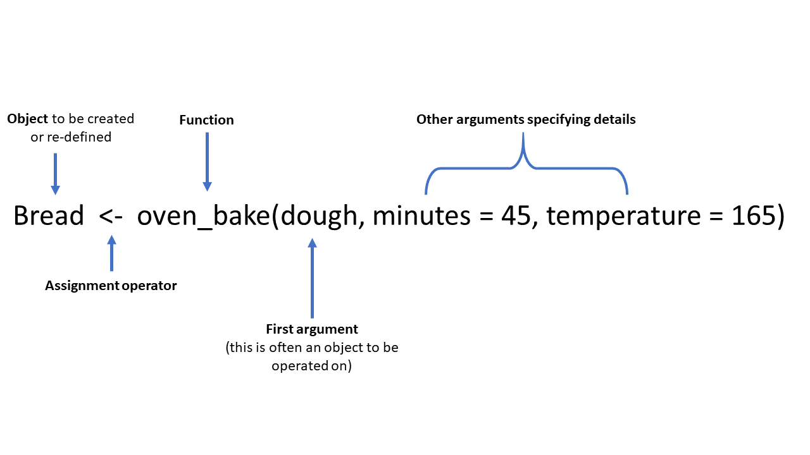

```{r setup, include = FALSE}
knitr::opts_chunk$set(
  comment = ""
)
```

------------------------------------------------------------------------

    Timetable week: 11
    Topic: "Variables and descriptive statistics"
-----------------------------------------------------------------------

# Intro


# Readings


Core readings:

Gelman et al. (2020): Chapters 2 (again) and 3 (pp. 21–47)
 

Secondary readings:

Agresti (2018): Chapters 3 and 4 (pp. 29–94)
Byrne (2002): Chapter 6 (pp. 95–111)

Online training:

If you did not complete the online `R`/`RStudio` training during reading week, complete it as soon as possible. The labs/workshops provide only limited time to complete more substantive quantitative analysis exercises, so you should make sure to get a firmer grasp of the software outside class.

Datacarpentry online training "R for Social Scientists": https://datacarpentry.org/r-socialsci


# Exercise 1: Getting to know the RStudio interface

`About 60  minutes`

------------------------------------------------------------------------

The term "`R`" is used to refer to both the programming language and the software that interprets the scripts written using it. To make it easier to interact with R, we will use RStudio. RStudio is the most popular IDE (Integrated Development Environment) for R. An IDE is a piece of software that provides tools to make programming easier. To function correctly, RStudio needs R and therefore both need to be installed on your computer. To install them on your own personal computers (**Windows** or **MacOS**), see the guidance on [Canvas](https://ncl.instructure.com/courses/48074/pages/software-requirements-and-access?module_item_id=2500821) or on [R for Social Scientists](https://datacarpentry.org/r-socialsci/setup.html).

R and RStudio should be available on all computers in the IT labs. You can find RStudio among the list of programs (in the Start menu) and open the programme directly. This will open a new RStudio session in the computer's default working directory. To make sure that all your files and outputs that you create are in the same place and accessible regardless of the computer you are using, it's best to get into the practice of using RStudio **projects**.

## Task 1: Open an RStudio project

An **RStudio Project** stores all the files and data objects and performs all the operations relative to the location of the project's root file on the computer.

To create a new R Project select *File > New Project* from the top RStudio menu.  

Creating a new R project will create:  

* A new project directory (folder)  
* A R project file (.Rproj) in the project folder that serves as a shortcut to open the project via RStudio  

Note:  

* You can make sub-folders for data, scripts, etc.  
* All files produced by R scripts saved to the project will also save into the project folder

You can try creating a new R Project, but for simplicity, you can download a folder already set up as an R Project from here: 

1. Download the compressed folder into a suitable location on your **OneDrive - Newcastle University** drive. This will allow you to access your files from any computer by logging into your university OneDrive account. 
2. Once downloaded, use the *Compressed Folders Tools* to extract the contents of the compressed folder.

The contents of the downloaded folder should look like this:


If you double-click on *SOC2069-Statistical-analysis.Rproj*, the project will open in a new RStudio window. The advantage of having an .Rproj file in the folder that you are using is that you don't have to worry about setting manually any paths to files that you will be using or producing; everything is stored relative to where the .Rproj file is located on your computer.

## Task 2: Using R scripts

R scripts are special text documents where you can write and execute commands in the `R` programming language. You can create an R Script from within RStudio by going to *File > New File > R Script* (also CNTRL + SHIFT + N). We already have an example R script in the folder you have just downloaded: **Lab6.R**. You can click on that file to open it. It will load in the upper left panel of RStudio. This example R script contains mainly comments and a single command, a simple arithmetic operation (1 + 3 - 5 + 7). You can use this script file to copy/paste commands from this window into it so you can run the commands in R.

## Task 3: Explore the RStudio (main) Panes

Let's have a closer look at the four (main) panes of RStudio:


### The R Console Pane  
The R Console, by default the left or lower-left pane in R Studio, is the home of the R "engine". This is where the commands are actually run and non-graphic outputs and error/warning messages appear. The **Console** is the direct interface to the `R` software itself; it's what we get if instead of `RStudio` we open the `R` software: a direct interface to the `R` programming language, where we can type commands and **where results/messages are printed**.

You can directly enter and run commands in the R Console, but realize that these commands are not saved as they are when running commands from a script. For this reason, we should not use the **Console** pane directly too much. For typing commands that we want `R` to execute, we should instead use an `R` script file, where everything we type can be saved for later and complex analyses can be built up. 

### The Source Pane  
This pane, by default in the upper-left, is a space to edit and run your scripts. This pane can also display datasets (data frames) for viewing.

### The Environment Pane  
This pane, by default the upper-right, is most often used to see brief summaries of objects in the R Environment in the current session. These objects could include imported, modified, or created datasets, parameters you have defined, or vectors or lists you have defined during analysis. You can click on the arrow next to a dataframe name to see its variables.

:::: {.notebox .note}
**Note**

If your Environment pane is empty, it means that you don't have any "objects" loaded or created yet. We will be creating some objects later and we will also import an example dataset.
::::


### Files, Plots, Packages, Help, etc  
The lower-right pane includes several tabs including plots (display of graphics including maps), help, a file library, and available R packages (including installation/update options).  

You can arrange the panes in different ways, depending on your preferences, using *Tools > Global Options in the top menu.* So the arrangement of panes may look different on different computers.

## Task 3: Start using functions and user-written packages

Most work in R is done using *Functions*. The most common operations involving a function take the following generic form (think of an analogy of baking a loaf of bread):



It's possible to **create your own functions**. This makes R extremely powerful and extendable. But instead of programming our own functions, we can rely on functions written by other people and bundled within **packages**. There are a large number of reliable, tested and oft-used packages containing functions that are particularly useful for social scientists. In this module, we will rely on several such user-written packages that extend the basic packages already bundled in with our `R` software (the so-called *base-R* packages and functions).

Packages are often available from the *Comprehensive R Archive Network* (CRAN) or private repositories such as *Bioconductor*, *GitHub* etc. Packages made available on CRAN can be installed using the command `install.packages("packagename")`. Once the package/library is installed (i.e. it is sitting somewhere on your computer), we then need to _load_ it to the current R session using the command `library(packagename)`.

### Installing and loading the `tidyverse`

Let's begin by installing and loading one of the most useful suite of packages called the 'tidyverse' (you can read more about the tidyverse [here](https://www.tidyverse.org/)). Type or copy the command below into the Console window and click Enter (or write it in the *Lab6.R* script file and run it from there; in fact, this command is already there in the script):

```{r eval=F}
install.packages("tidyverse")

library(tidyverse)
```

We now have access to functions contained in the 'tidyverse' bundle of packages. We can check the suite of packages that are loaded with the `tidyverse` library using a command from the `tidyverse` itself:

```{r, eval=FALSE}
tidyverse_packages()
```

If we don't want to load a package that we have downloaded - because maybe we only want to use a single function once and we don't want to burden our computer's memory - we can state explicitly which package the function is from by using the form *package::function*, like this:

```{r, eval=FALSE}
tidyverse::tidyverse_packages()
```

I will sometimes use this form in the worksheets to clarify what package a function originates from, even if the package is loaded in the library.

### Installing some other packages

:::: {.taskbox .task}

Now that you've installed a package, write the required functions in your R scripts to install and load the following two packages that we will be using later in this session:

- mosaic
- sjmisc
::::

### Load a dataset

So far we have learnt about some useful functions for installing and loading R packages. We can now look at functions that can be used to load a dataset into the Environment pane. We will load a dataset stored in `R`'s native format: .rds. There are other functions that are useful for loading data stored in other formats, particularly the most commonly used generic *comma separated values* (.csv) format, but we won't use them now.

Let's load the dataset called `ukhls_w8.rds` that is included in the *SOC2069-Statistical-analysis* project folder you downloaded earlier. We'll use the `readRDS` function and the assignment operator (`<-`) to create an object called "data" that will store the dataset (we can give any name to the object, but it's useful to have something short that is easy to type because we will be typing it a lot when writing commands targetted to that dataset). Copy the following command into your R script and run it from there:

```{r eval=FALSE}
data <- readRDS("ukhls_w8.rds")
```

This will only work if you are within an R Project; otherwise you need to provide the complete file path to the dataset. Another option (in this case), is to load the same dataset from the course's online repository with the following command:

```{r}
data <- readRDS("https://github.com/CGMoreh/SOC2069/raw/main/docs/Data/ukhls_w8.rds")
```


You can now see that an object called "data" was created in the Environment pane, and next to it we have some information about the number of observations and variables in the dataset. If we click on the blue button with the white arrow before the name of the object, a list of variables and other information about them will roll down. If we click on the object's name or info, the dataset will open in the Sources pane, just next to the R script file. This is equivalent to having run the following command:
```{r eval=FALSE}
View(data)    

# Note the capital "V"; R is case-sensitive, so always pay attention; view(data) won't work
```

You can explore the dataset a bit. Only the first 50 columns (i.e. variables) are displayed, to see the next 50 you can click on arrow (>) in the dataset window's toolbar. Once you've had a quick look, you can close that view or return to the R script.


