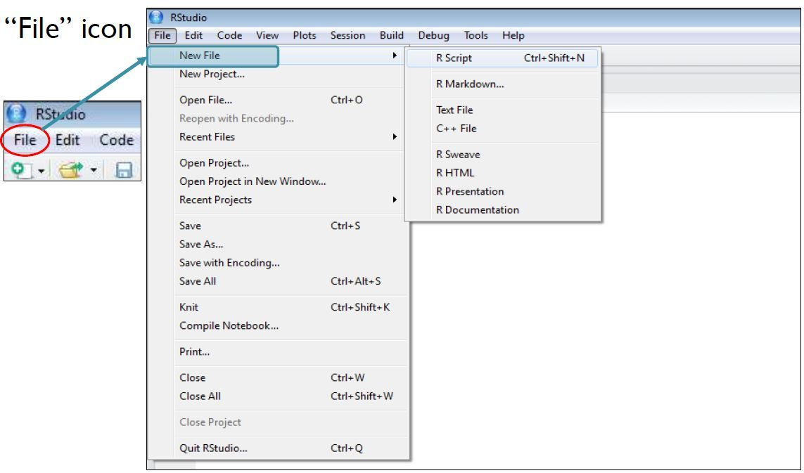

```{r setup, include = FALSE, purl=FALSE}
# knitr::knit_hooks$set(purl = knitr::hook_purl)

knitr::opts_chunk$set(error = FALSE, warning=FALSE, comment="", prompt=FALSE, message = F, strip.white = F, fig.width=6, fig.asp = 0.618, fig.show = 'hold')
```

```{r klippy, echo=FALSE, include=TRUE, purl=FALSE}
klippy::klippy(position = c('right'))
```

------------------------------------------------------------------------

    Timetable week: 13
    Topic: 
    New `R` commands:

------------------------------------------------------------------------

```{r, include=FALSE}
### ---- Lab 7 script ---- ###
```


# Intro
# Readings
# Exercise 0: Setup

1.  **Open the `R Studio` interface** by clicking on the *SOC2069-Statistical-analysis**.Rproj*** file included in the **_SOC2069-Statistical-analysis_** project folder that you downloaded from Canvas in Lab6. The folder should be stored on your Newcastle University **OneDrive** and accessible from any computer

    `r fontawesome::fa("wrench")`   If you haven't yet downloaded the project folder in TW11 (Lab6), then [download it from Canvas](https://ncl.instructure.com/courses/48074/pages/data-access-and-description?module_item_id=2544656). **Tip:** If you haven't completed the Lab6 worksheet, it will be difficult to follow the next steps; please go through *Exercise 1* and *2* of [Lab6](https://cgmoreh.github.io/SOC2069/Worksheets/Lab6)).

2.  **Create a new blank `R` script** for this lab session and call it *Lab7.R*

    `r fontawesome::fa("wrench")` Check *Exercise 1, Task 2* of [*Lab6*](https://cgmoreh.github.io/SOC2069/Worksheets/Lab6)) if you need help with this. **Tip:**
```{r, echo=F, purl=FALSE}
#| out.width="40%",  fig.topcaption = TRUE, fig.align = "center", 


```
<center>or</center> 
```{r, echo=F, purl=FALSE}
#| out.width="40%",  fig.topcaption = TRUE, fig.align = "center", 

knitr::include_graphics("images/new_script_2.jpg")
```


3. **Write a comment line** at the top of the new script to briefly detail what the script is about (e.g. *\# Script for Lab x, Week y*). **Tip:** in `R` scripts the hashtag (\#) denotes that the text following it on the same line is just a comment, not a programming command.


3.  **Load user-written `R` packages** we commonly use with the `library()` function

    `r fontawesome::fa("wrench")`   Check *Exercise 1, Task 4* of [*Lab6*](https://cgmoreh.github.io/SOC2069/Worksheets/Lab6) if you need help with this. **Tip:** You may need to first install the package with the `install.packages()` function if it's not yet installed
```{r include=FALSE}
##### Load packages ----------
```

    ```{r}
# install.packages(c("tidyverse", "mosaic", "sjmisc")) 
# If you need to first install the packages, remove the hashtag from in front of the `install.packages()` command to un-comment the command and make it executable in R
    
    library(tidyverse)
    library(mosaic)
    library(sjmisc)
    ```

4.  **Load the *ukhls_w8.rds* dataset** to an object in the session Environment; let's call that object "ukhls" this time

    `r fontawesome::fa("wrench")`   Check *Exercise 1, Task 4* of [*Lab6*](https://cgmoreh.github.io/SOC2069/Worksheets/Lab6)) if you need help with this. **Tip:** Specifying only the file name without a path assumes that you have followed Step 1 above correctly and your working directory is the RProject. If not, go back to Step 1.

```{r include=FALSE}
##### Read in data ----------
```
    ```{r eval=FALSE}
    ukhls <- readRDS("ukhls_w8.rds")
    ```

```{r include=FALSE, purl=FALSE}
ukhls <- readRDS(url("https://cgmoreh.github.io/SOC2069/SOC2069-Statistical-analysis/ukhls_w8.rds"))
```

# Exercise 1: 

`About 60  minutes`

------------------------------------------------------------------------

For all data analysis tasks, we will follow a "0 + 5"-step workflow. First (**"Step 0"**, because it's not really a separate analytical step), state the research question you are attempting to answer; then (**Step 1**) find and understand variables (data) that help you answer that question; then (**Step 2**) modify (wrangle) any variables that need to be adjusted to help the analysis and interpretation; then (**Step 3**) describe how your *outcome* variables and main *predictor* variable(s) are related. This will help with the interpretation of the statistical results and with identifying any further changes to the variables that may be needed (returning to Step 2 again). You may also wish to check the relationship between your predictor variables if you have more than one (but we're not using multiple predictors yet); then (**Step 4**) apply the statistical model that is most appropriate to answer the "research question"; and finally (**Step 5**) summarise the results from your analysis using tables, figures and your own words. In each exercise, we'll go step-by-step.


## Step 0: Formulate your **"analysis research question"** 

```{r include=FALSE}
##### Step x ----------
```

## Step 1: **Find, describe and understand** your variables
## Step 2: **Modify** your variables (if needed)

```{r include=FALSE}

```


## Step 3: **Describe** the relationship between your variables
```{r include=FALSE}
##### Step x ----------
```

## Step 4: **Model** the relationship between your variables

```{r include=FALSE}
##### Step 4: Linear modeling ----------
```

## Step 5: **Present** and **interpret** your findings
# Exercise 2: On your own

------------------------------------------------------------------------

::: {.taskbox .task}
**Task**

Find some other numeric variables whose relationship can be modelled using a linear regression and undertake a complete analysis like the one in Exercise 1. 

There aren't too many useful numeric variables in the UKHLS dataset, so you'll have to work with what you have to come up with interesting "research questions" to answer. 

This is also what you'll be required to do in Assignment 2, so your time and effort will not be wasted!

:::


```{r eval=FALSE, include=F, purl=FALSE}
knitr::purl("", "", documentation=0)
```

