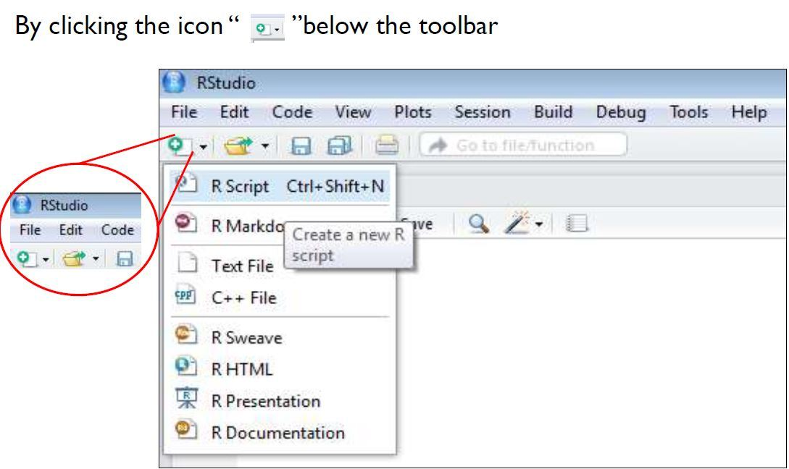

```{r, include=FALSE, purl=FALSE}
options(repos = list(CRAN="http://cran.rstudio.com/"))
```

```{r setup, include = FALSE, purl=FALSE}
# knitr::knit_hooks$set(purl = knitr::hook_purl)

knitr::opts_chunk$set(error = FALSE, warning=FALSE, comment="", prompt=FALSE, message = F, strip.white = F, fig.width = 5, fig.asp = .8, fig.align = "center", fig.show = 'hold', class.output = "outputbox")
```

```{r klippy, echo=FALSE, include=TRUE, purl=FALSE}
pacman::p_load_gh("rlesur/klippy"); klippy(position = c('right'))
```

------------------------------------------------------------------------

    Timetable week: 14
    Topic: "Modelling binary outcomes: logistic regression"

------------------------------------------------------------------------

```{r, include=FALSE}
### ---- Lab 9 script ---- ###
```

# Intro

This worksheet introduces a new type of regression model: *(binary) logistic regression*.

The logistic regression model attempts to **predict the probability that an observation falls into one of two categories of a dichotomous dependent (outcome) variable** based on one or more independent (predictor) variables that can be either continuous (numeric) or categorical ("factors" in `R`, whether categories are ordered or not).

In many ways, logistic regression is like linear regression, except for the measurement type of the dependent variable (i.e., linear regression uses a numeric dependent variable rather than a dichotomous one). However, unlike in linear regression, **you are not attempting to determine the predicted value** of the dependent variable, **but the *probability* of being in a particular category** of the dependent variable given the independent variables. An observation is assigned to whichever category is predicted as most likely.

A logistic regression is thus based on the fact that the outcome has only two possible values: 0 or 1. Often, 1 is used to denote a "case" whereas 0 is then a "non-case". (E.g. Is someone a smoker? Yes='the case', or 'true', No='non-case', or 'false'). Logistic regression is used to predict the "odds" of being a "case" based on the values of the x-variable(s). Just as for linear regression analysis, we get a **coefficient** (the '**log of the odds**') that **shows the effect of x on y**. However, because logistic regression is based on other assumptions than linear regression, we cannot interpret these coefficients very easily. Instead, we focus on something called the "**odds ratio**" (OR). The "**odds ratio**" can never be negative -- it can range between 0 and infinity, with the value **1** representing **equal odds** (i.e. no effect - just like **0** represented 'no effect' in linear regression). What the OR actually stands for -- and whether we can say that an effect is small or big -- depends on the values of x and y. The OR can be further transformed into probabilities, which are standardised values (i.e. between 0 and 1, and as such convertible to a percentage between 0% and 100%). and are easier to interpret.

We will use the same data from Wave 8 (2016-2017) of the [UK Household Longitudinal Study (UKHLS/Understanding Society) Main Survey](https://www.understandingsociety.ac.uk/documentation/mainstage).

# Readings

Core readings:

- Gelman et al. (2020): Chapter 13 (pp. 217–237)
 

Secondary readings:

- Gelman et al. (2020): Chapter 14 (pp. 241–259)
- Agresti (2018): Chapter 15 (pp. 459–488)
 

Further readings:

- Gelman et al. (2020): Chapter 16 (pp. 291–310)

`r fontawesome::fa("save")` [**Download the module reading pack from here (.zip 47MB)**](https://github.com/CGMoreh/SOC2069/raw/main/readings/soc2069-reading-pack.zip)

# Exercise 0: Setup

1.  **Open the `R Studio` interface** by clicking on the *SOC2069-Statistical-analysis**.Rproj*** file included in the ***SOC2069-Statistical-analysis*** project folder that you downloaded from Canvas in Lab6. The folder should be stored on your Newcastle University **OneDrive** and accessible from any computer

    `r fontawesome::fa("wrench")` If you haven't yet downloaded the project folder in TW11 (Lab6), then [download it from Canvas](https://ncl.instructure.com/courses/48074/pages/data-access-and-description?module_item_id=2544656). **Tip:** If you haven't completed the Lab6 worksheet, it will be difficult to follow the next steps; please go through *Exercise 1* and *2* of [Lab6](https://cgmoreh.github.io/SOC2069/Worksheets/Lab6)).

2.  **Create a new blank `R` script** for this lab session

    `r fontawesome::fa("wrench")` Check *Exercise 1, Task 2* of [*Lab6*](https://cgmoreh.github.io/SOC2069/Worksheets/Lab6)) if you need help with this. **Tip:**

    ```{r, echo=F, purl=FALSE}
    #| out.width="40%",  fig.topcaption = TRUE, fig.align = "center", 

    knitr::include_graphics("images/new_script_1.jpg")
    ```

    <center>or</center>

    ```{r, echo=F, purl=FALSE}
    #| out.width="40%",  fig.topcaption = TRUE, fig.align = "center", 

    
    ```

3.  **Write a comment line** at the top of the new script to briefly detail what the script is about (e.g. *\# Script for Lab x, Week y*). **Tip:** in `R` scripts the hashtag (*\#*) denotes that the text following it on the same line is just a comment, not a programming command.

4.  **Load user-written `R` packages** we commonly use with the `library()` function

    `r fontawesome::fa("wrench")` Check *Exercise 1, Task 4* of [*Lab6*](https://cgmoreh.github.io/SOC2069/Worksheets/Lab6) if you need help with this. **Tip:** You may need to first install the package with the `install.packages()` function if it's not yet installed

    ```{r include=FALSE}
    ##### Load packages ----------
    ```

    ```{r}
    # If you need to first install the packages, remove the hashtag 
    #   from in front of the `install.packages()` command to un-comment it 
    #   and run it

    # install.packages(c("tidyverse", "mosaic", "sjmisc", "jtools"))     

    library(tidyverse)
    library(mosaic)
    library(sjmisc)
    library(jtools)
    ```


5.  **Load the *ukhls_w8.rds* dataset** to an object in the session Environment; let's call that object "ukhls":

```{r include=FALSE}
##### Read in data ----------
```

    ```{r eval=FALSE}
    ukhls <- readRDS("ukhls_w8.rds")
    ```
    `r fontawesome::fa("wrench")`   Check *Exercise 1, Task 4* of [*Lab6*](https://cgmoreh.github.io/SOC2069/Worksheets/Lab6)) if you need help with this. **Tip:** Specifying only the file name without a path assumes that you have followed Step 1 above correctly and your working directory is the RProject. If not, go back to Step 1.

    <span style="color:red">`r fontawesome::fa("wrench")`   If you have accidentally overwritten the original dataset with incorrect transformations to variables, you can download the original dataset again from here: </span> **[https://cgmoreh.github.io/SOC2069/SOC2069-Statistical-analysis/ukhls_w8.rds](https://cgmoreh.github.io/SOC2069/SOC2069-Statistical-analysis/ukhls_w8.rds)**. <span style="color:red">Save it to the project folder, replacing the old dataset.</span>

```{r include=FALSE, purl=FALSE}
ukhls <- readRDS(url("https://cgmoreh.github.io/SOC2069/SOC2069-Statistical-analysis/ukhls_w8.rds"))
```

# Exercise 1: What factors influence smoking behaviour?

`About 60  minutes`

------------------------------------------------------------------------

## Step 0: Formulate your **"research question"**

Say we want to find out what are the factors that influence smoking behaviour (i.e. smoking or not smoking). If this is our **research question**, then we need a dependent variable relating to smoking behaviour and some independent variables relating to possible influencing factors.

We know that in the UKHLS (Understanding Society) dataset we have a useful variable relating to smoking, which could serve as the dependent variable (if we search the [data catalogue](https://cgmoreh.github.io/SOC2069/Data/ukhls_w8) we find the following variable: ***smoker***, a factor variable with two levels ("yes" and "no") with relatively few missing values (4.4%). We already see there how the variable is distributed, with the majority of the respondents (85%) being non-smokers.

Now that we know that the variable we want to predict ("smoker") is a categorical variable with two categories, we know that a linear regression would not be the appropriate method. Instead, the statistical model we should use is the logistic regression.

Now we need to ask ourselves about what independent variables we want to include. These are the variables that can potentially influence smoking behaviour. This is primarily a theoretical question (i.e. thinking logically, or based on our readings of sociological literature, what factors might have an influence on smoking?), but we also need to make sure that any variable (factor) we think of, actually exists in our data-set. So let’s look at our data-set and search for some possible factors.

For this example exercise I propose that we consider the following three variables as our independent variables: ***sex***, ***age_dv*** and **finnow** ["Subjective financial situation - current"].

***If this were your assessment research question*, you would start by first examining each variable separately using descriptive statistics, and examining how predictors are associated with the dependent variable using bivariate descriptive statistics. After that, you would want to check how all the factors considered together might influence smoking behaviour, for which a logistic regression is the appropriate method.**


## Step 1: **Find, describe and understand** your variables

```{r include=FALSE}
##### Step 1: Selecting variables ----------
```

We have already practised descriptive statistics a lot, so this step should be easy by now. We also already know how the "age_dv" and "sex" variables look like, but for the sake of practice - as you would also do in your assignment! - let's run some descriptive statistics on them too. "Smoker" and "finnow" (or "=current financial situation, *fin*ancial situation *now*) are new variables to us.


::: {.taskbox .task}
```{r eval=F, purl=FALSE}
### Complete the code below


# Descriptive statistics for 'sex':

...

# Descriptive statistics for 'age_dv':

...

# Descriptive statistics for 'smoker':

...


# Descriptive statistics for 'finnow':

...


```

```{r include=FALSE, fig.show='asis'}
##### Student task: descriptive stats ----------

# Descriptive statistics for 'sex':

ukhls %>% sjmisc::frq(sex)

# or #

frq(ukhls$sex)           # with sjmisc:: loaded


# Descriptive statistics for 'age_dv':

favstats( ~ age_dv, data = ukhls)         # with mosaic:: loaded


# Descriptive statistics for 'smoker':

frq(ukhls$smoker)         # with sjmisc:: loaded


# Descriptive statistics for 'finnow':

frq(ukhls$finnow)         # with sjmisc:: loaded

```
:::


::: {.questionbox .question}
**Questions**

Examine the descriptive results from the tables you've produced and answer:

-   What is the valid percentage of smokers in the dataset?
-   What *type* of variable is **finnow**?
-   What is the total number of survey respondents who declared that they are finding it quite or very difficult to get by with their available financial resources?

:::


::: {.codebox .code}
**Coding tip**: Use `select()` with `summary()`

There's an easy way to get some quick summary statistics for a selected small number of variables of interest from a dataset. We can first use `select()` to select out the variables we want, then ask for a `summary()` on the whole of that selected mini-dataset:

```{r}
ukhls %>% 
  select(sex, age_dv, smoker, finnow) %>% 
  summary()
```

Note that this only shows basic descriptives, so for example we do not get the percentage distribution of the frequencies in the frequency tables for categorical variables, so we can't easily answer all the questions above using this.
:::


## Step 2: **Modify** your variables (if needed)

Now that we know how our variables look like, let's think: are there any variables that require some modification? 
Not necessarily, in this case, becasue we don't have any obvious mistakes or superfluous labels/categories in these variables.
We know from previous weeks that recoding the *age* variable by median-centring it may help with the interpretation of the regression results because then the "Intercept" coefficient would not refer to someone who is aged 0, but to someone who has the median age in our dataset.
Because we usually do not need to interpret the "intercept" in multiple regression (with many predictors included in the model), we can leave the *age* variable as it is for now.
The only change that we may want to ponder is whether combining the last two levels/categories of the *financial situation* variable may be sensible. The reason for this may be because these two levels contain far fewer responses than the other three categories, and it's always better to have a balanced categorical variable. However, the number of responses in each category is still large enough not to cause statistical complications for the model. The other reason why we may want to collapse the last two categories into one, is that it will make reading the regression output far more manageable. We know from the previous week that if we include a categorical variable as predictor into a regression model, we need to break it down into a series of new binary/dummy variables, one for each level/category. We know that `R` does this automatically for us if we tell it that our variable is a *factor* (i.e. categorical), but then in the output we will have quite a few variables to interpret, each with its own regression coefficient. Finally, if we wanted to collapse the last two categories, we could do so because it would make sense conceptually to group together those who are "finding it ... difficult". We may even be able to make an argument that those who are "just about getting by" are closer to those who are finding it difficult than to those who are "doing alright", and we may decide to collapse the last three categories together.
These are all subjective choices for us as data analysts to make. We need to consider both statistical/mathematical criteria (e.g. the number of cases/responses in the various categories) as well as substantive sociological knowledge about the topic (in this, case, self-assessed poverty).
Cutting out or collapsing data always means that we are throwing away additional information that could potentially be useful. It's a trade-off that we need to consider. But as a first step in any analysis, once we have considered what transformations was be possible or necessary, I suggest that you always fit a first model on the complete dataset to get a sense of how the model behaves, and then decide whether any transformation may be preferable.
So, for now, we won't change anything.


## Step 3: **Describe** the relationship between your variables

We have many variables here, so we will need to focus on the most useful comparisons. What we are interested in is how our predictor variables relate to our outcome variable, ***smoker***. 

```{r}
sjmisc::flat_table(smoker, sex, data = ukhls)  %>% chisq.test()

sjmisc::flat_table(smoker, sex, margin="row", data = ukhls)  %>% chisq.test()

sjPlot::tab_xtab(ukhls$smoker, ukhls$sex, show.summary = TRUE)


```


### *Boxplots* to compare group medians


```{r eval=FALSE, include=FALSE, purl=FALSE}
# Just run this chunk manually at the end...
knitr::purl("Lab8.Rmd", documentation = 0)
```

```{r eval=FALSE, include=FALSE, purl=FALSE}

# Presenting results; for future use

sjPlot::tab_model(model_ex1)
```
