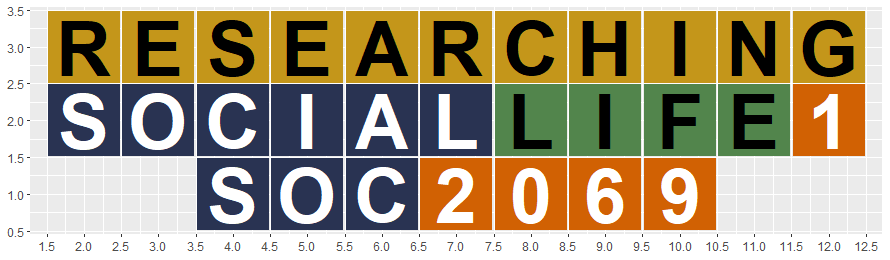

```{r setup, include=FALSE}
knitr::opts_chunk$set(echo = FALSE)

# Learn more about creating websites with Distill at:
# https://rstudio.github.io/distill/website.html

# Learn more about publishing to GitHub Pages at:
# https://rstudio.github.io/distill/publish_website.html#github-pages

```

```{css}
d-title {
    display: none;
}
```

<br><br>

<center>



</center>

### Welcome to **Researching Social Life 1**


### Try out your `R` code here

<iframe width="100%" height="1000" src="https://rdrr.io/snippets/embed/?code=print(%22Hello%2C%20world!%22)" frameborder="0">

</iframe>
